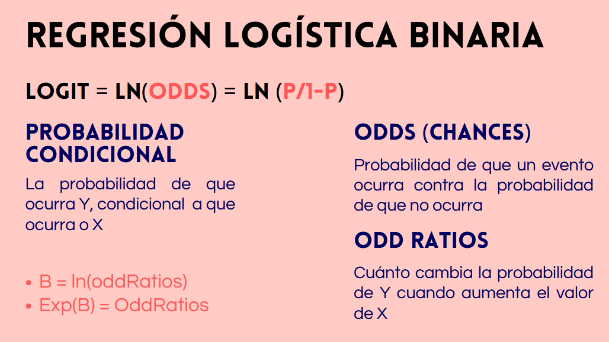

---
format:
  clean-revealjs:
    self-contained: true
    slide-number: true
    transition: fade
    chalkboard: false
lang: es
execute:
  echo: true
  message: false
  warning: false
---

#  {background-color="#40666e"}

::: {style="text-align: left; padding-top: 10px; line-height: 1.3;"}
[Repaso: Regresión Logística, ACP y Diseño de Cuestionario]{style="font-size: 2.2em; font-weight: 600; color: #D49A3B; display: block; margin-bottom: 5px; line-height: 1.1;"}

[Ayudantía 09 · FAGOB 2026]{style="font-size: 1.2em; font-weight: 400; letter-spacing: 0.5px; display: block; margin-bottom: 10px;"}

[Métodos Cuantitativos para la Administración Pública]{style="font-size: 1.2em; font-weight: 400;  display: block; margin-bottom: 40px;"}

[Cristóbal Mejías · Facultad de Gobierno]{style="font-size: 1.3em; display: block; color: #D1DCE2;"} [26 de junio 2026]{style="font-size: 1.3em; display: block; margin-bottom: 15px; color: #D1DCE2;"} [[\[Repositorio de ayudantías\]](https://github.com/Cristobal-Mejias-G/metodos-cuantitativos-fagob){style="color: #cbdffa;"}]{style="font-size: 1.3em; font-weight: 400;"}
:::


# Repaso de contenidos {background-color="#40666e"}

## 
### Estructura de la sesión

::: {style="font-size: 0.85em;"}
Esta ayudantía repasa los contenidos centrales de la última etapa del curso. El objetivo es consolidar los conceptos fundamentales antes de la evaluación final.

Temas:

1. Regresión logística: fundamentos, interpretación y ajuste
2. Análisis de Componentes Principales (ACP): objetivos, criterios y resultados
3. Diseño de cuestionario: estructura, tipos de preguntas y ética
:::


# 1 · Regresión Logística {background-color="#40666e"}

## 
### ¿Cuándo usar regresión logística?

::: {style="font-size: 0.85em;"}
La regresión logística se utiliza cuando la **variable dependiente es binaria o dicotómica**: toma solo dos valores posibles (por ejemplo, 1 = participó / 0 = no participó; 1 = aprobó / 0 = reprobó).

**¿Por qué no usar regresión lineal (OLS) en este caso?**

- OLS puede producir **predicciones fuera del rango [0, 1]**, lo cual es imposible para una probabilidad.
- Una línea recta no representa bien cómo cambia la probabilidad de un evento a lo largo de una variable independiente: la relación real es de forma **sigmoidal**, no lineal.

La regresión logística modela directamente la **probabilidad** de que ocurra el evento, garantizando que las predicciones se mantengan entre 0 y 1.
:::

## 
### La cadena de transformaciones

::: {style="font-size: 0.75em;"}
Para comprender la regresión logística, es clave entender tres conceptos encadenados:

**1. Probabilidad** ($p$): posibilidad de que ocurra el evento.

**2. Odds (chances):** razón entre la probabilidad de que ocurra y la de que no ocurra.

$$\text{Odds} = \frac{p}{1 - p}$$

**3. Logit:** logaritmo natural de los odds. Esta es la transformación que el modelo estima en escala lineal.

$$\text{logit}(p) = \ln\left(\frac{p}{1-p}\right) = \beta_0 + \beta_1 X_1 + \cdots + \beta_k X_k$$

Para volver a probabilidades se aplica la función logística inversa:

$$p = \frac{e^{\text{logit}}}{1 + e^{\text{logit}}}$$
:::

## 
### Interpretación de coeficientes: tres formas

::: {style="font-size: 0.85em;"}
Los coeficientes del modelo pueden expresarse de tres maneras:

| Forma | Cómo se obtiene | Interpretación |
|-------|:---------------:|----------------|
| **Log-odds** ($\beta$) | Directamente del modelo | Cambio en el logaritmo de los odds por cada unidad de $X$. Difícil de interpretar sustantivamente. |
| **Odds Ratio** (OR) | $e^{\beta}$ | Cuántas veces más (o menos) son las chances de que ocurra el evento por cada unidad de cambio en $X$. OR > 1: aumenta; OR < 1: disminuye. |
| **Probabilidad predicha** | Aplicar la función logística al logit | Forma más intuitiva. Se fijan valores de las variables y se convierte el logit a probabilidad. |

**Ejemplo:** si el OR de ser mujer es 11,78, las mujeres tienen 11,78 veces más chances de experimentar el evento que los hombres (categoría de referencia), manteniendo las demás variables constantes.
:::

##



##

### Evaluación del ajuste

::: {style="font-size: 0.85em;"}
En regresión logística **no se usa el $R^2$ de OLS**. Las medidas de ajuste se basan en la **log-verosimilitud** ($\ell$):

| Medida | Descripción |
|--------|-------------|
| **Devianza** | Cuantifica los residuos del modelo. A menor devianza, mejor ajuste. |
| **Test LRT** | Compara dos modelos anidados: $G^2 = -2(\ell_{\text{restringido}} - \ell_{\text{completo}})$. Sigue una distribución $\chi^2$ con grados de libertad igual al número de parámetros añadidos. |
| **AIC** | Penaliza por el número de variables. Permite comparar modelos no anidados. **Menor AIC = mejor modelo.** |
| **Pseudo $R^2$ de McFadden** | Compara el modelo estimado con un modelo nulo. Valores entre 0,2 y 0,4 se consideran aceptables; **no** debe interpretarse como el $R^2$ lineal. |
:::

## 
### En R: `glm()` con `family = "binomial"`

::: {style="font-size: 0.85em;"}
En R, la regresión logística se estima con la función `glm()`:

```r
modelo <- glm(y ~ x1 + x2 + x3,
              data   = datos,
              family = "binomial")

summary(modelo)
```

- El argumento `family = "binomial"` indica que la variable dependiente es dicotómica.
- Los coeficientes que entrega `summary()` están en **log-odds**.
- Para obtener los **odds ratios**: `exp(coef(modelo))` o `exp(confint(modelo))`.
- Para obtener **probabilidades predichas**: `predict(modelo, type = "response")`.
:::


# 2 · Análisis de Componentes Principales (ACP) {background-color="#40666e"}

## 
### ¿Qué es el ACP?

::: {style="font-size: 0.75em;"}
El ACP es un método estadístico **multivariante** de tipo **exploratorio y descriptivo**. Su objetivo es explicar un conjunto de $p$ variables observables mediante un número menor $k$ de variables latentes llamadas **componentes principales**, con la menor pérdida de información posible.

**¿Para qué sirve?**

- **Reducción de dimensionalidad:** sintetizar muchas variables en pocos componentes interpretables.
- **Construcción de indicadores sintéticos:** crear un puntaje único que resuma varias dimensiones (por ejemplo, un índice de capacidad institucional).
- **Solución a la multicolinealidad:** reemplazar variables altamente correlacionadas por componentes ortogonales (independientes entre sí) antes de incluirlos en una regresión.
- **Representación gráfica:** proyectar datos complejos en dos o tres dimensiones para visualizar agrupamientos.

**El ACP no busca relaciones causales**: agrupa variables, no establece dependencias.
:::

## 
### ACP vs. Análisis Factorial: diferencias clave

::: {style="font-size: 0.75em;"}
Aunque se usan de forma similar, tienen diferencias técnicas importantes:

| Criterio | ACP | Análisis Factorial (AFE) |
|----------|-----|--------------------------|
| **Varianza considerada** | Total | Común (comunalidad) |
| **Naturaleza** | Combinaciones lineales reales de las variables originales | Modelo matemático con dimensiones latentes "ocultas" |
| **Dirección** | Los componentes se explican a partir de las variables | Las variables dependen de los factores latentes |
| **Uso habitual** | Reducción de datos, indicadores sintéticos | Validación de escalas, análisis psicométrico |

En la práctica, cuando el objetivo es **reducir variables** para análisis posteriores, se prefiere el ACP. Cuando el objetivo es **identificar rasgos latentes no observables**, se prefiere el AFE.
:::

## 
### Requisitos para aplicar ACP

::: {style="font-size: 0.85em;"}
Para que un ACP sea válido y tenga sentido, deben cumplirse las siguientes condiciones:

**1. Correlación entre variables**
Las variables originales deben estar correlacionadas entre sí. Si son independientes, no hay información común que reducir y el ACP carece de sentido. Se puede verificar con la prueba de esfericidad de Bartlett o el índice KMO.

**2. Nivel de medición**
Las variables deben ser **cuantitativas** (escala de intervalo o razón). En la práctica, se aceptan variables ordinales con al menos 5 categorías de respuesta.

**3. Tamaño muestral**
Se recomienda un mínimo de **150 a 200 observaciones**. Muestras pequeñas producen componentes inestables.

**4. Estandarización**
Si las variables tienen escalas distintas, se analiza la **matriz de correlaciones** (no la de covarianzas) para que todas contribuyan por igual a la varianza total.
:::

## 
### Criterios para retener componentes

::: {style="font-size: 0.85em;"}
El ACP extrae tantos componentes como variables hay, pero solo se retienen los más informativos. Los criterios son:

| Criterio | Descripción |
|----------|-------------|
| **Regla de Kaiser** | Retener componentes con **valor propio (eigenvalue) > 1**. Cada componente retenido explica más varianza que una sola variable original. |
| **Varianza acumulada** | Retener suficientes componentes para cubrir entre el **70% y 90%** de la varianza total. |
| **Scree plot** | Gráfico de valores propios en orden descendente. Se retienen los componentes previos al "**codo**" (punto donde la curva se vuelve plana). |
| **Interpretabilidad** | **Criterio más importante.** Los componentes retenidos deben tener sentido teórico y ser nombrables a partir de las variables que los componen. |

En la práctica, se usan varios criterios en conjunto. Cuando hay conflicto entre ellos, la interpretabilidad es el árbitro final.
:::

## 
### Cargas factoriales e interpretación

::: {style="font-size: 0.70em;"}
Los resultados del ACP se expresan en una **matriz de cargas factoriales**: correlaciones entre cada variable original y cada componente.

**¿Cómo interpretar un componente?**

1. Identificar las variables con cargas más altas **en valor absoluto** (convención: |carga| ≥ 0,40 o 0,50).
2. Observar el **signo**: cargas positivas y negativas en el mismo componente indican que las variables se mueven en direcciones opuestas.
3. Proponer un **nombre sustantivo** que capture la dimensión latente que une a esas variables.
:::

## 
### Puntuaciones factoriales

::: {style="font-size: 0.85em;"}
Una vez retenidos los componentes, el ACP asigna a cada observación un **puntaje** (puntuación factorial) en cada componente. Estas puntuaciones son variables nuevas, continuas y **ortogonales entre sí** (correlación = 0).

**Usos principales de las puntuaciones factoriales:**

- **Indicador sintético:** puede usarse directamente como índice que resume las variables originales (por ejemplo, un índice de capacidad institucional).
- **Insumo para regresión:** al reemplazar variables correlacionadas por componentes ortogonales, se elimina la multicolinealidad.
- **Clustering:** las puntuaciones permiten agrupar observaciones en un espacio de menor dimensión.

**Precaución:** los componentes son combinaciones lineales de las variables originales. Su interpretación depende del analista y debe estar respaldada por una justificación teórica sólida.
:::


# 3 · Diseño de Cuestionario {background-color="#40666e"}

## 
### Encuesta vs. cuestionario

::: {style="font-size: 0.85em;"}
Es importante distinguir dos conceptos que suelen confundirse:

**Encuesta social**
Es el **proceso de investigación completo**: diseño, aplicación, recolección y análisis de datos. Implica una interacción asimétrica entre el investigador (que conduce) y el sujeto (cuyo habla está delimitada por el instrumento).

**Cuestionario**
Es el **instrumento específico**: el conjunto de preguntas y respuestas predefinidas que se aplica a los participantes.

**¿Cuándo construir un cuestionario propio?**
Solo cuando no existen fuentes secundarias adecuadas (como CASEN, CEP, Estudio Mundial de Valores) o cuando se requiere medir constructos que esas fuentes no cubren para la población de interés. La construcción propia tiene **altos costos en tiempo y recursos**, por lo que debe justificarse.
:::

## 
### Modos de aplicación

::: {style="font-size: 0.85em;"}
El diseño del cuestionario debe adaptarse al modo en que se administrará:

| Modo | Ventajas | Desventajas |
|------|----------|-------------|
| **Cara a cara** | Mayor control, menor tasa de rechazo, permite aclarar dudas | Mayor costo, riesgo de sesgo del entrevistador en temas íntimos |
| **Telefónico** | Menor costo, cobertura geográfica amplia | Mayor tasa de rechazo, no permite mostrar materiales visuales |
| **Auto-aplicado (papel)** | Ideal para temas sensibles, reduce sesgo del entrevistador | Requiere instrucciones muy claras, depende del nivel de lectura del encuestado |
| **Auto-aplicado (internet)** | Bajo costo, rapidez | Sesgo de selección (solo usuarios con acceso y habilidad digital) |

La elección del modo afecta la redacción de las preguntas, la extensión del instrumento y los sesgos a controlar.
:::

## 
### Estructura del cuestionario

::: {style="font-size: 0.85em;"}
Un cuestionario bien diseñado sigue un **orden lógico** que construye confianza progresivamente:

**A) Presentación**
Explicación breve del estudio, garantía de anonimato y búsqueda de confianza. Debe ser corta y no intimidante.

**B) Preguntas filtro**
Determinan si el sujeto cumple los criterios de inclusión del estudio (por ejemplo, edad, cargo, territorio).

**C) Identificación no intrusiva**
Antecedentes básicos que no generan suspicacia: sexo, edad, nivel educativo.

**D) Cuerpo del cuestionario**
Las preguntas sobre los constructos centrales. Se avanza de temas **simples y generales** hacia constructos más **complejos o privados**.

**E) Identificación intrusiva y cierre**
Preguntas sensibles (ingresos, bienes, situación laboral) al final, cuando ya hay confianza. Siempre cerrar agradeciendo la participación.
:::

## 
### Tipos de preguntas

::: {style="font-size: 0.80em;"}
Las preguntas se clasifican según su **contenido** y según el **formato de respuesta**:

**Por contenido:**

- **Hechos:** datos objetivos y precisos (fecha, cantidad, condición). Requieren exactitud.
- **Conocimientos o aptitudes:** evalúan lo que el encuestado sabe o puede hacer.
- **Opiniones o actitudes:** miden percepciones, valoraciones o disposiciones. Son las más comunes en ciencias sociales.

**Por formato de respuesta:**

- **Cerradas simples:** dicotómicas (sí/no) u opciones mutuamente excluyentes.
- **Cerradas con escala:** escalas Likert u ordinales. Permiten capturar intensidad o grado.
- **Cerradas múltiples:** el encuestado puede elegir más de una opción.
- **Abiertas:** respuesta libre. Aportan riqueza cualitativa pero son difíciles de procesar. **Usar con mesura.**
:::

## 
### Redacción de preguntas: recomendaciones

::: {style="font-size: 0.85em;"}
Una pregunta bien redactada es breve, neutra y unívoca. Recomendaciones clave:

- **Brevedad:** menos de 20 palabras por pregunta siempre que sea posible.
- **Una sola idea por pregunta:** evitar preguntas dobles ("¿Es rápida y amable la atención?").
- **Evitar palabras éticamente cargadas** o con connotación positiva/negativa que induzcan una respuesta.
- **Evitar la doble negación:** dificulta la comprensión y genera errores.
- **No inducir la respuesta:** las preguntas no deben sugerir cuál es la respuesta "correcta" o "esperada".
- **Lenguaje accesible:** adaptar el vocabulario al nivel del público objetivo.
- **Reutilizar preguntas validadas:** si otra encuesta ya midió el mismo constructo con validez demostrada, es preferible copiar esa pregunta a redactar una nueva.
:::

## 
### Sesgos de medición

::: {style="font-size: 0.85em;"}
Los principales sesgos que afectan la validez de las respuestas son:

**Deseabilidad social**
Tendencia a responder lo que se considera socialmente aceptable en lugar de la opinión o conducta real. Es especialmente relevante en temas como corrupción, discriminación o consumo de sustancias. Se mitiga con cuestionarios auto-aplicados y garantizando el anonimato.

**Efecto de primacía y recencia**
Tendencia a seleccionar las primeras opciones de una lista (primacía) o las últimas (recencia), independientemente del contenido. Se controla rotando el orden de las opciones entre encuestados.

**Aquiescencia**
Tendencia a responder afirmativamente con independencia del contenido de la pregunta. Se controla incluyendo ítems redactados en dirección contraria al constructo.
:::

## 
### Ética en la investigación con encuestas

::: {style="font-size: 0.85em;"}
Toda investigación con personas debe cumplir estándares éticos mínimos:

**Consentimiento informado**
El participante debe ser informado del propósito del estudio, los riesgos y beneficios posibles, y su derecho a no participar o retirarse en cualquier momento. La participación debe ser **voluntaria**.

**Anonimato y confidencialidad**
Las respuestas no deben ser identificables individualmente. Esto no solo protege al encuestado, sino que también **reduce el sesgo de deseabilidad social**.

**Revisión ética**
Los estudios con seres humanos deben pasar por un **comité de ética** institucional antes de su aplicación.

**Tabla de especificaciones**
Antes de redactar preguntas, se recomienda construir una tabla que conecte cada **constructo** con sus **dimensiones** e **indicadores operacionales**, asegurando que el cuestionario mide lo que dice medir (validez de contenido).
:::


# Nos vemos en la evaluación. ¡Mucho éxito! {background-color="#40666e"}
